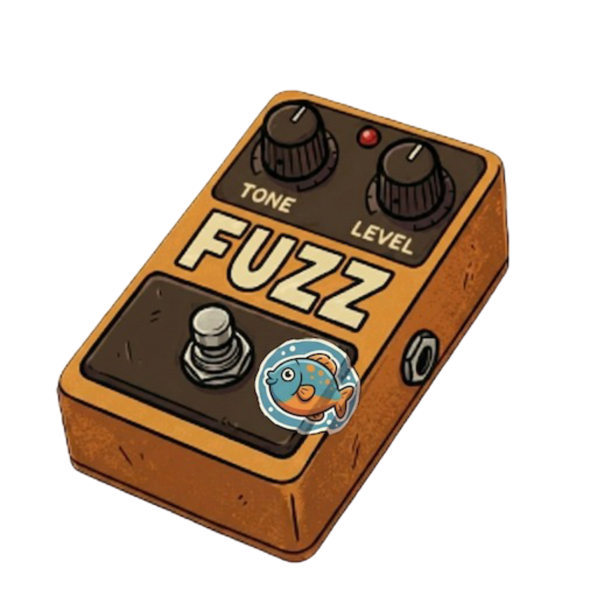

# fuzz.fish



fuzz.fish is a Fish Shell plugin that provides fuzzy finding for command history,
files, git branches, git worktrees, git commits, and GitHub pull requests.

Press `ctrl+r` to open it, type to search, and switch modes with a single key.
No external finder required — a single Go binary ships with the plugin.

[](https://github.com/jedipunkz/fuzz.fish/actions/workflows/ci.yml)
[](https://github.com/jedipunkz/fuzz.fish/releases)
[](https://opensource.org/licenses/MIT)

<br clear="left" />

<p align="center">
  
</p>

## Why fuzz.fish?

- **Nothing else to install.** No `fzf`, `fd`, `ripgrep`, or `bat` alongside it: the plugin is a single Go binary plus Fish keybindings.
- **One keybinding, six modes.** `ctrl+r` opens the finder; `ctrl+s`, `ctrl+w`, `ctrl+g`, `ctrl+x` and `ctrl+j` switch modes without closing it.
- **Every mode has a preview.** History shows when and where the command ran and what surrounded it, files show syntax-highlighted content, and branches, worktrees and commits show their git context. Branch and worktree previews list their last 5 commits, oneline style.
- **History ranked by frecency.** Match quality ranks first, then `log1p(frequency)` scaled by how recently you last ran the command, so what you actually repeat surfaces first.
- **Git beyond branches.** Worktrees and commits are first-class: `ctrl+x` matches a commit by hash or subject and puts `git show` / `git diff` / `git revert` / `git cherry-pick` on the prompt without running it.

## Requirements

- [Fish Shell](https://fishshell.com/) 3.0+
- [GitHub CLI (`gh`)](https://cli.github.com/), authenticated with `gh auth login` — only for Pull Request Search (`ctrl+j`). The other modes work without it.

Installing the plugin downloads a prebuilt binary for macOS and Linux
(`amd64` / `arm64`). On any other platform it falls back to building from
source, which needs [Go](https://golang.org/) 1.25+ and Git.

## Installation

### Using Fisher (Recommended)

```fish
fisher install jedipunkz/fuzz.fish
```

## Usage

Press `ctrl+r` to open fuzz.fish, then type to search. Switch modes at any time with a single key:

| Key | Mode | `enter` does |
|-----|------|--------------|
| `ctrl+r` | Command History Search (default) | Insert the command into your prompt |
| `ctrl+s` | File Search | Insert the file path / `cd` into the directory |
| `ctrl+w` | Git Worktree Search | `cd` into the worktree |
| `ctrl+g` | Git Branch Search | Switch to the selected branch |
| `ctrl+x` | Git Commit Search | Pick a command to run against the commit |
| `ctrl+j` | Pull Request Search (needs `gh`) | Check out the PR branch in a worktree and `cd` into it |

Common keys:

| Key | Action |
|-----|--------|
| `↑`/`↓` or `ctrl+p`/`ctrl+n` | Move the selection |
| `tab` | Complete the query with the selected item |
| `ctrl+y` | Copy the selected item to the clipboard |
| `esc` or `ctrl+c` | Cancel |

Notes:

- Anything already typed on the command line pre-fills the search box, so `vim` then `ctrl+r` starts with history narrowed to `vim`.
- A `*` in the query switches from fuzzy to glob matching in every mode: `nvim *.go` matches `nvim internal/app/filter.go` but not commands that merely contain those letters.
- In Git Branch Search mode, pressing `ctrl+g` again on the current branch runs `git pull origin <branch>`.
- Git Commit Search matches both the short hash and the commit subject. `enter` opens a small action list (`git show`, `git diff`, `git revert`, `git cherry-pick`, `git rebase --onto`, or the bare hash); the chosen command is placed on the prompt without running it. `ctrl+x` outside a git repository shows a warning instead of switching modes.
- File Search skips hidden files and build directories such as `node_modules` and `vendor`.
- Pull Request Search lists the open pull requests of the current repository via `gh pr list`, searchable by number and title. The preview shows the pull request, repository, author, head branch, and the local worktree that has the branch checked out. `enter` `cd`s into that worktree; with no such worktree it first creates one with `git worktree add` (see `worktree_dir` under [Configuration](#configuration)). Either way `gh pr checkout <number>` runs inside it to fetch the remote branch. If `gh` is missing or not authenticated, the error is shown in the status line.

## Configuration

Keybindings inside the finder and the worktree location for Pull Request Search can be set in `~/.config/fuzz.fish/fuzz.fish.yaml`. The file is optional; without it the defaults above apply.

List only the actions you want to change. Each listed action replaces its default keys, and an empty list unbinds it. Binding one key to two actions is an error.

```yaml
keybinds:
  history: [ctrl+r]
  git_branch: [ctrl+g]
  files: [ctrl+s]
  worktree: [ctrl+w]
  commit: [ctrl+x]
  pull_request: [ctrl+j]
  select: [enter]
  complete: [tab]
  copy: [ctrl+y]
  quit: [esc, ctrl+c]
  up: [up, ctrl+p]
  down: [down, ctrl+n]
```

`worktree_dir` sets where Pull Request Search creates worktrees. It must be an absolute path or start with `~/`.

```yaml
worktree_dir: ~/gm/.worktrees
```

| `worktree_dir` | Worktree for PR #42 from `feat/foo` in `github.com/user/repo` |
|---|---|
| unset (default) | `<parent of the main worktree>/repo-pr-42` |
| `~/gm/.worktrees` | `~/gm/.worktrees/github.com/user/repo/feat/foo` |

An existing directory at that path is reused instead of created again.

The key that opens fuzz.fish from the shell (`ctrl+r`) is a Fish binding, not part of this file; add another with e.g. `bind \ct fh` in your `config.fish`.


## License

MIT License - see LICENSE file for details

